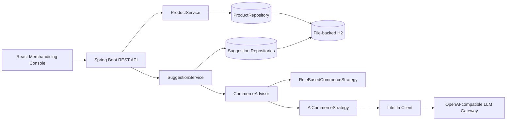
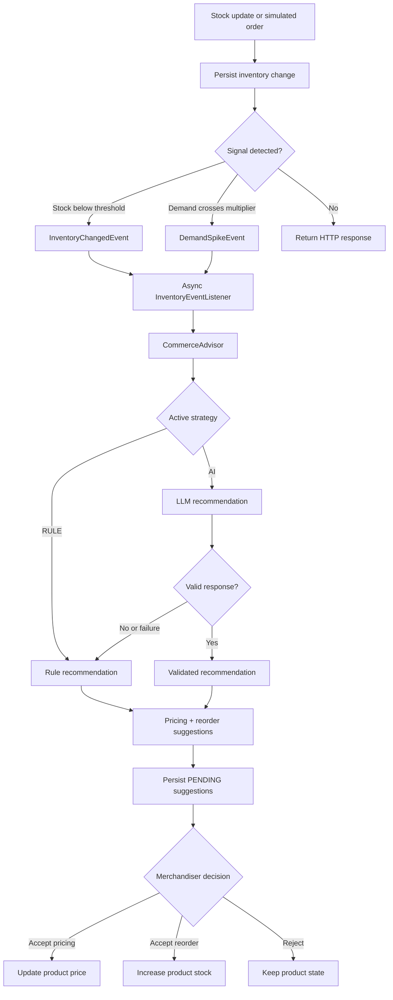

# StockPulse

## 1. About StockPulse

StockPulse is an inventory intelligence and dynamic pricing application for merchandisers. It detects low inventory and demand signals, creates pricing and replenishment suggestions, and keeps a human approval checkpoint before applying changes.

The current application includes a Spring Boot backend, a React merchandising console, rule-based recommendations, optional AI recommendations, asynchronous event processing, and persistent local H2 storage.

## 2. Key Features

- Product catalog with stock, price, category, demand velocity, and lifecycle state.
- Low-inventory detection when stock falls below the reorder threshold.
- Demand-spike detection using a configurable category comparison multiplier.
- Rule-based pricing and reorder recommendations.
- Optional OpenAI-compatible LLM strategy with response validation and rule fallback.
- Runtime switching between `RULE` and `AI` commerce strategies.
- Asynchronous Spring event processing with `@Async` after inventory changes commit.
- Idempotency for pending suggestions by product, trigger, and suggestion type.
- Human approval for pricing and reorder recommendations.
- Persistent accepted prices and stock changes using file-backed H2.
- React dashboard with polling, pending-only review queue, decision history, stock controls, and sale simulation.

## 3. Tech Stack

### Backend

- Java 17+
- Spring Boot 3.3
- Spring Web and RestClient
- Spring Data JPA / Hibernate
- Bean Validation
- H2
- Jackson
- Spring Events and `@Async`
- Maven

### Frontend

- React 18
- Vite
- JavaScript
- CSS
- Browser Fetch API

## 4. Architecture

The frontend calls the REST API. Product and inventory services persist state and publish domain events. The commerce advisor selects the active strategy, while suggestion services persist recommendations and apply only approved decisions.



## 5. Agentic Flow

Inventory changes and orders publish events after the transaction commits. The asynchronous listener creates both suggestion types through the same commerce advisor. Recommendations remain pending until a merchandiser accepts or rejects them.



## 6. How to Run the Project

### Prerequisites

- Java 17 or newer
- Maven
- Node.js and npm

### Start the Backend

From the project root:

```powershell
cd backend
mvn spring-boot:run
```

The backend runs at `http://localhost:8080`. It uses file-backed H2 storage in `backend/data/` and seeds demo products when the database is empty.

### Start the Frontend

Open a second terminal from the project root:

```powershell
cd frontend
npm install
npm run dev
```

Open the Vite URL shown in the terminal, usually `http://localhost:5173` or `http://127.0.0.1:5173`.

### Run Tests and Build

Backend tests:

```powershell
cd backend
mvn test
```

Frontend production build:

```powershell
cd frontend
npm run build
```

The default commerce strategy is `RULE`. AI mode is optional and uses environment variables for the LLM gateway; credentials are not stored in this repository.

## 7. Complete Project Structure

```text
stockpulse/
├── README.md
├── ADR.md
├── .gitignore
├── docker-compose.yml
├── backend/
│   ├── pom.xml
│   └── src/
│       ├── main/java/com/stockpulse/
│       │   ├── StockPulseApplication.java
│       │   ├── ai/
│       │   │   ├── AiPromptBuilder.java
│       │   │   ├── AiRecommendationPayload.java
│       │   │   ├── AiRecommendationValidator.java
│       │   │   ├── AiResponseParser.java
│       │   │   ├── LiteLlmClient.java
│       │   │   └── LlmClient.java
│       │   ├── commerce/
│       │   │   ├── AiCommerceStrategy.java
│       │   │   ├── CommerceAdvisor.java
│       │   │   ├── CommerceContext.java
│       │   │   ├── CommerceRecommendation.java
│       │   │   ├── CommerceStrategy.java
│       │   │   └── RuleBasedCommerceStrategy.java
│       │   ├── config/
│       │   │   ├── AsyncConfig.java
│       │   │   ├── CorsConfig.java
│       │   │   ├── LlmConfig.java
│       │   │   └── WebConfig.java
│       │   ├── controller/
│       │   │   ├── CommerceStrategyController.java
│       │   │   ├── PricingSuggestionController.java
│       │   │   ├── ProductController.java
│       │   │   └── ReorderSuggestionController.java
│       │   ├── dto/
│       │   │   ├── order/OrderRequest.java
│       │   │   ├── product/CreateProductRequest.java
│       │   │   ├── product/ProductResponse.java
│       │   │   ├── product/UpdateStockRequest.java
│       │   │   └── suggestion/
│       │   │       ├── PricingSuggestionResponse.java
│       │   │       ├── ReorderSuggestionResponse.java
│       │   │       └── SuggestionDecisionRequest.java
│       │   ├── entity/
│       │   │   ├── InventorySnapshot.java
│       │   │   ├── PricingSuggestion.java
│       │   │   ├── Product.java
│       │   │   └── ReorderSuggestion.java
│       │   ├── enums/
│       │   │   ├── Category.java
│       │   │   ├── PricingDirection.java
│       │   │   ├── ProductLifecycle.java
│       │   │   ├── SuggestionStatus.java
│       │   │   └── TriggerReason.java
│       │   ├── event/
│       │   │   ├── DemandSpikeEvent.java
│       │   │   ├── InventoryChangedEvent.java
│       │   │   └── InventoryEventListener.java
│       │   ├── exception/
│       │   │   ├── AiServiceException.java
│       │   │   ├── GlobalExceptionHandler.java
│       │   │   ├── InvalidSuggestionException.java
│       │   │   └── ResourceNotFoundException.java
│       │   ├── repository/
│       │   │   ├── InventorySnapshotRepository.java
│       │   │   ├── PricingSuggestionRepository.java
│       │   │   ├── ProductRepository.java
│       │   │   └── ReorderSuggestionRepository.java
│       │   ├── seed/DataInitializer.java
│       │   └── service/
│       │       ├── InventoryService.java
│       │       ├── PricingSuggestionService.java
│       │       ├── ProductService.java
│       │       ├── ReorderSuggestionService.java
│       │       └── SuggestionService.java
│       ├── main/resources/
│       │   ├── application.yml
│       │   └── data.sql
│       └── test/java/com/stockpulse/
│           ├── StockPulseApplicationTest.java
│           ├── ai/AiRecommendationValidatorTest.java
│           ├── commerce/RuleBasedCommerceStrategyTest.java
│           ├── event/InventoryEventListenerTest.java
│           └── service/
│               ├── SuggestionApprovalServiceTest.java
│               └── SuggestionServiceTest.java
├── frontend/
│   ├── package.json
│   ├── package-lock.json
│   ├── vite.config.js
│   ├── index.html
│   └── src/
│       ├── App.jsx
│       ├── main.jsx
│       ├── api/
│       │   ├── productApi.js
│       │   └── suggestionApi.js
│       ├── components/
│       │   ├── common/
│       │   │   ├── Button.jsx
│       │   │   ├── EmptyState.jsx
│       │   │   ├── ErrorState.jsx
│       │   │   └── LoadingState.jsx
│       │   ├── layout/
│       │   │   ├── DashboardLayout.jsx
│       │   │   ├── Header.jsx
│       │   │   └── Sidebar.jsx
│       │   ├── product/
│       │   │   ├── ProductCard.jsx
│       │   │   ├── ProductTable.jsx
│       │   │   └── StockIndicator.jsx
│       │   └── suggestion/
│       │       ├── ConfidenceBadge.jsx
│       │       ├── PricingSuggestion.jsx
│       │       ├── ReorderSuggestion.jsx
│       │       ├── SuggestionCard.jsx
│       │       └── TriggerBadge.jsx
│       ├── constants/
│       │   └── mockData.js
│       ├── hooks/
│       │   ├── useProducts.js
│       │   ├── useStockPulse.js
│       │   └── useSuggestions.js
│       ├── pages/
│       │   ├── Dashboard.jsx
│       │   ├── Products.jsx
│       │   └── Suggestions.jsx
│       ├── services/pollingService.js
│       └── styles/
│           └── app.css
```

## 8. API Endpoints

### Products

| Method | Endpoint | Purpose |
| --- | --- | --- |
| `POST` | `/products` | Create a product. |
| `GET` | `/products?status=&category=` | List products with optional lifecycle and category filters. |
| `PATCH` | `/products/{id}/stock` | Set stock level and evaluate inventory signals. |
| `POST` | `/products/{id}/orders` | Simulate a sale and update stock and demand velocity. |
| `POST` | `/products/{id}/suggest-pricing` | Create a manual pricing suggestion. |
| `POST` | `/products/{id}/suggest-reorder` | Create a manual reorder suggestion. |

### Suggestions

| Method | Endpoint | Purpose |
| --- | --- | --- |
| `GET` | `/pricing-suggestions` | List pricing suggestions, including decision history. |
| `PATCH` | `/pricing-suggestions/{id}` | Accept or reject a pricing suggestion. |
| `GET` | `/reorder-suggestions` | List reorder suggestions, including decision history. |
| `PATCH` | `/reorder-suggestions/{id}` | Accept or reject a reorder suggestion. |

### Runtime Strategy

| Method | Endpoint | Purpose |
| --- | --- | --- |
| `PATCH` | `/commerce-strategy` | Switch the active strategy between `RULE` and `AI` without restarting. |

For local development, run the backend with `mvn spring-boot:run` from `backend/` and the frontend with `npm run dev` from `frontend/`. LLM credentials are supplied through environment variables and are not stored in this repository.
